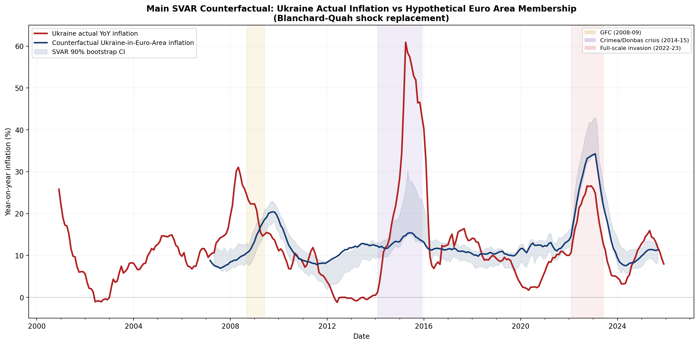

# Counterfactual Inflation Analysis: What if Ukraine had been part of the Euro Area?

This repository contains a reproducible take-home exam on a single research question: how would Ukraine's year-on-year inflation path have differed if the country had operated inside the Euro Area rather than under its observed monetary and exchange-rate regimes?

The project compares actual Ukraine YoY inflation with a counterfactual Ukraine-in-the-Euro-Area inflation path. The headline result is the main Blanchard-Quah SVAR counterfactual rather than a simple Euro Area average.

## Structure

The repository is organized around two connected parts.

- **Part A** documents Ukraine's de facto monetary and exchange-rate regime chronology from 2000 to 2025.
- **Part B** uses that chronology to define the treatment intensity of hypothetical Euro Area membership when constructing the inflation counterfactual.

The treatment is intentionally time-varying rather than constant. Euro membership is modeled as a smaller change during de facto peg periods, a larger change during the 2008-09 and 2014-15 devaluation episodes and the post-2016 inflation-targeting period, and a constrained change again during the wartime fixed-rate and capital-control period.

## Methodology

Ukraine CPI enters the repository as month-on-month index data with previous month set equal to 100. The data pipeline chains monthly factors into year-on-year inflation so that Ukraine can be compared directly with Euro Area HICP inflation rates.

The main specification is a **Blanchard-Quah SVAR** shock-replacement counterfactual. Ukraine and the Euro Area are each modeled in bivariate systems with output growth and inflation. Euro Area membership is operationalized as replacing Ukraine's domestic demand and monetary shocks with Euro Area demand shocks while preserving Ukraine-specific supply shocks. Supply shocks are allowed to have permanent effects on output, while demand and monetary shocks are restricted to have zero long-run effect on output. This follows the Blanchard-Quah identification logic and is the repository's headline model.

The counterfactual is therefore not a simple Euro Area average. It preserves Ukraine-specific supply disturbances while asking how inflation would have evolved if the domestic nominal-demand component had behaved like that of a Euro Area member.

Robustness checks are secondary to the main specification.

- **Stationarity-robustness SVAR**: re-estimates the same structural logic on first-differenced inflation.
- **Reduced-form projection benchmark**: a single-horizon OLS benchmark with regime weighting. It is explicitly **not** a local projection.
- **ASCM robustness check**: donor-based benchmark retained only as a supporting comparison.

## Main Findings

The current main SVAR counterfactual implies four headline episode averages.

- **2008-09 global financial crisis**: actual inflation exceeded the counterfactual by **+5.7 pp**.
- **2014-15 Crimea/Donbas crisis**: actual inflation exceeded the counterfactual by **+18.1 pp**.
- **Post-2016 inflation-targeting period**: actual inflation was **-2.1 pp** below the counterfactual.
- **2022 full-scale invasion**: actual inflation was **-6.8 pp** below the counterfactual.

These results suggest that monetary sovereignty was inflationary during the major devaluation crises, so Euro Area membership would likely have lowered inflation in 2008-09 and especially in 2014-15. After the 2016 transition to inflation targeting, the gap becomes smaller and reverses sign. In 2022, the sign reversal is larger: the euro counterfactual is above actual inflation, which is consistent with the view that wartime monetary sovereignty gave the NBU crisis-management tools that a Euro Area member would not have had.

## Figures



*Figure 1. Required Part B main figure: actual Ukraine YoY inflation and the main SVAR counterfactual inflation path, with bootstrap uncertainty band.*

Additional robustness figures are generated into `figures/`, but they are not displayed here because the hand-in should foreground the main SVAR counterfactual rather than the robustness SVAR plots.

## How To Run

Tested with **Python 3.14.4**.

Install dependencies and run the full pipeline:

```bash
python3 -m venv .venv
source .venv/bin/activate
pip install -r requirements.txt
bash run.sh
```

For a longer bootstrap run:

```bash
FULL_BOOTSTRAP=1 bash run.sh
```

To remove local caches and build the final hand-in archive:

```bash
bash clean_submission.sh
```

This creates `ukraine_counterfactual_submission.zip`.

## Repository Structure

- `scripts/` — data pipeline, external-data fetchers, and Part B counterfactual code.
- `data/` — raw inputs, cleaned panels, macro controls, donor weights, and final counterfactual results.
- `figures/` — main figure plus robustness and diagnostic figures used in the write-up.
- `outputs/` — SVAR diagnostics, stationarity-robustness diagnostics, reduced-form projection diagnostics, and model summary.
- `Part_A_Ukraine_Monetary_Regime.md` / `Part_A_Ukraine_Monetary_Regime.docx` — Part A chronology deliverable.
- `Part_B_counterfactual_interpretation.md` — Part B interpretation anchored on the main SVAR figure.
- `README.md` — project overview and reproducibility instructions.
- `run.sh` — end-to-end pipeline runner.
- `clean_submission.sh` — submission cleanup and zip creation.

## Caveats

- The baseline and robustness VARs still show some instability, so the diagnostics should be read transparently rather than hidden.
- The stationarity-robustness SVAR confirms the qualitative episode pattern even when the system is transformed.
- The reduced-form projection benchmark has a weak and statistically insignificant FX coefficient in the stable-period calibration, so it is not the headline model.
- The robustness specifications are supporting checks only. The main result for the hand-in is the Blanchard-Quah SVAR shock-replacement counterfactual shown in `figures/fig_counterfactual_main_svar.png`.
